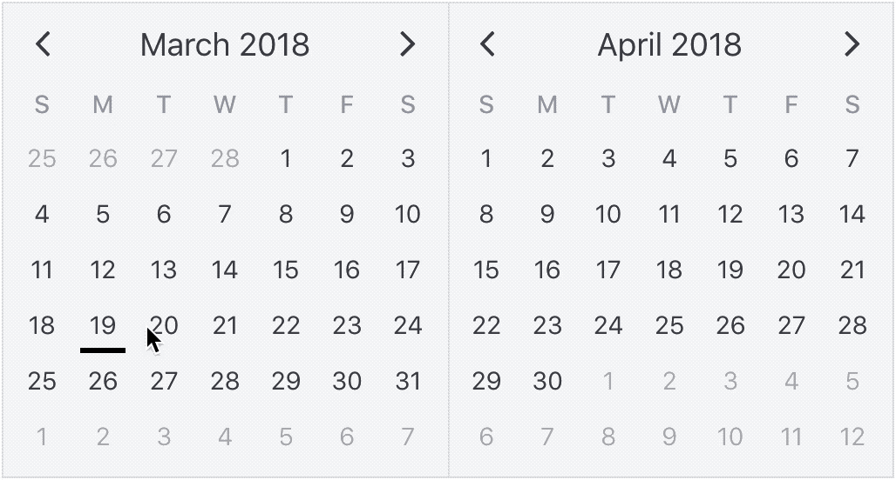
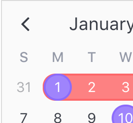

# Attributes

[Click here to reference the API for attributes.](api.md#attribute)

Attributes are what bring `v-calendar` to life. They are simply visual decorators that can be applied to specific calendar dates.

<p align='center'>
  
</p>

As mentioned in the introduction, there are many kinds of attributes you can configure, including the following:

  * Highlights
  * Dots
  * Bars
  * Content Styles
  * Popovers

Any one or more of these attribute types may be combined into one single attribute object, and you can supply as many attributes as you want, like so:

```html
<v-calendar
  :attributes='attributes'>
</v-calendar>
```

```javascript
...
data() {
  return {
    // Attributes are supplied as an array
    attributes: [
      // This is a single attribute
      {
        // An optional key can be used for retrieving this attribute later,
        // and will most likely be derived from your data object
        key: 1,
        // The attribute can contain any of the following object types
        highlight: { ... },
        dot: { ... },
        bar: { ... },
        popover: { ... },
        contentStyle: { ... },
        // Supply your custom data object for later access, if needed
        customData: { ... },
        // We also need some dates to know where to display the attribute
        // We use a single date here, but it could also be a date range
        //  or a complex date pattern.
        // Arrays are also allowed
        dates: new Date(),
        // You can optionally provide dates to exclude.
        // All other dates are used by the attributed.
        excludeDates: null,
        // Think of `order` like `z-index`
        order: 0
      }
    ];
  }
}
```

### Using functions

The primary attribute object types (highlights, dots, bars, popovers, content styles) may also be defined as functions that accept an object parameter with the following properties and return a configured object.

| Property Name | Type    | Description |
| ------------- | ------- | ----------- |
| [`day`](api.md#day-object) | Object | Object with specific information about the day displaying the attribute. |
| [`targetDate`](data.md#dateinfo--attributes-lifecycle) | Object | Date info object currently used to display attribute. |
| `isHovered` | Boolean | Day element is currently hovered over. |
| `isFocused` | Boolean | Day element is currently focused. Only applies when a popover is configured. |
| `onStart` | Boolean | Day lies on the first day of the attribute's `targetDate`. |
| `onEnd` | Boolean | Day lies on the last day of the attributes's `targetDate`. |

This allows for creating attributes that are more dynamic and responsive to the user's actions. For example, when the user hovers over the attribute, the function is re-evaluated and the attribute is automatically reconfigured.

Consider this example where an opacity is applied to a bar attribute when it is hovered. Notice that functions are used to define the bar instead of the attribute itself.

```html
<v-calendar
  :attributes='attributes'>
</v-calendar>
```

```javascript
export default {
  data() {
    return {
      attributes: [
        {
          bar({ isHovered }) {
            return {
              backgroundColor: "black",
              opacity: (isHovered && 0.5) || 1
            };
          },
          dates: new Date()
        }
      ]
    };
  }
};
```

<p align='center'>
  
</p>

### Using `customData`

As well as specifying the attribute types we would like to display, note that you can also supply a `customData` property to link your custom data object. Just think of it as a way to tag the attribute with your data. The reason you might want to use this property becomes obvious as you begin to use the calendar. For example, if a user clicks on a calendar day that is displaying the attribute, you might want to react to that that click, so you will need to know that data associated with that attribute.

### Using `order`

By default, attributes are ordered to display the most information possible. For example, when attributes with highlighted regions overlap, single date regions appear above date range regions, and date ranges with a later start date appear above those with an earlier start date. 

<p align='center'>
  
</p>

If you would like to force an attribute to display above (or before) all others and override these rules, assign an order value greater than 0.

## Using Dates

Understanding how to configure dates and date patterns is a critical part to getting the most out of `v-calendar` and `v-date-picker`. In this section, we'll cover all the options that are at your disposal to most efficiently specify how your attributes are getting displayed on the calendar.

> Note: Wrapping dates into an array is only required if need to use one or more dates. If you wish to assign a single date, the array isn't necessary (although it is still allowed).

Currently, there are four occasions where you can use date expressions:
  * `dates` prop for displaying dates for attributes
  * `exclude-dates` prop for displaying all other dates for attributes
  * `disabled-dates` prop for disabling dates for `v-date-picker`
  * `available-dates` prop for disabling all other dates for `v-date-picker`

### Explicit vs Implicit

In both occasions where date expressions are used (attributes and `v-date-picker`), you'll notice that they come in pairs. One expression is for the explicit form (`dates` for attributes, `disabled-dates` for `v-date-picker`), and the other expression is for the implicit form (`exclude-dates`, `available-dates`).

The explicit form is the most direct form of expressing what dates you want; you give it the date and the calendar displays the attribute on (or the date picker disables) that date.

However, it might be more efficient to express what dates you would like to exclude, or avoid. For example, in `v-date-picker`, if you only want to allow date selections in the month of January of 2018, both of these expressions would work:

```html
<v-date-picker
  v-model='myDate'
  :disabled-dates='[{ start: null, end: new Date(2017, 11, 31)}, { start: new Date(2018, 1, 1), end: null }]'>
</v-date-picker>
```

```html
<v-date-picker
  v-model='myDate'
  :available-dates='{ start: new Date(2018, 0, 1), end: new Date(2018, 0, 31) }'>
</v-date-picker>
```

As you can see, the second expression is more terse and declarative than the first. It even performs slighly better. The point is, just take a second to consider which method is best suited for your application.

### Simple Dates

The first kind of date expression allowed is a simple native Javascript date object. It is the most simple, and perhaps most common, way to configure `dates` for an attribute. Here is an example of displaying an attribute on today's date.

```javascript
...
data() {
  return {
    attributes: [
      {
        key: 'today',
        highlight: {
          ...
        },
        contentStyle: {
          ...
        },
        dates: new Date()
      }
    ]
  }
}
```

### Date Ranges

The second kind of date expression allowed is date ranges. They are expressed as a simple object with optionally defined start and end dates. For example, here is a date range for the month of January, 2018.

```javascript
{
  start: new Date(2018, 0, 1),
  end: new Date(2018, 0, 31)
}
```

If you would like to to specify an infinite start or end date, use a `null` value.

```javascript
{
  start: null, // From the beginning of time
  end: new Date() // Until today
}
```

Optionally, if using `null` dates, you can omit them entirely.

```javascript
{ end: new Date() } // Same as before
```

So an empty object is totally valid...

```javascript
{ } // From the beginning of time to the end of time
```

### Date Patterns

The third kind of date expression is date patterns. They can target dates that would be incredibly difficult, if not impossible, to do otherwise with simple dates or date ranges. To configure a date pattern, let's first consider a date range.

```javascript
{
  start: new Date(2018, 0, 1),  // Jan 1st, 2018
  end: new Date(2019, 0, 1)     // Jan 1st, 2019
}
```

The only thing we need to do to convert this date range into a date pattern is to start adding patterns to it. For this simple example, we'll just target the weekends.

```javascript
{
  start: new Date(2018, 0, 1),  // Jan 1st, 2018
  end: new Date(2019, 0, 1)     // Jan 1st, 2019
  weekdays: [1, 7]              // ...on Sundays and Saturdays
}
```

We can also target other specific day properties, like `days: [6, 15]` for the 6th and 15th of the month, `weeks: [-1]` for the last week of the month and even `ordinalWeekdays: { [-1]: 1 }` for the last Sunday of the month.

Let's consider another example of displaying dot indicators on the last Friday of every other month, starting on January 1st of 2018. We could do so like this.

```javascript
...
  attrs: [
    {
      dot: { backgroundColor: 'red' },
      dates: {
        start: new Date('1/1/2018'),
        monthlyInterval: 2,           // Every other month
        ordinalWeekdays: { [-1]: 6 }  // ...on the last Friday
      }
    }
  ]
...
```

Now, for some reason, we also want to display them on the 15th of every other month, so our first attempt might be to modify the dates to this:

```javascript
...
dates: {
  start: new Date('1/1/2018'),
  monthlyInterval: 2,           // Every other month
  ordinalWeekdays: { [-1]: 6 }, // ...on the last Friday
  days: 15                      // ...and on the 15th? (WRONG!)
},
...
```

But this would be **wrong**, because all component specifiers are conditionally *anded* with each other.

To evaluate a set of conditions *or* another set, we can break the sets of conditions out into an array assigned to the `on` property.

```javascript
...
dates: {
  start: new Date('1/1/2018'),
  monthlyInterval: 2,                 // Every other month
  on: [                               // ...on...
    { ordinalWeekdays: { [-1]: 6 } }, // ...the last Friday
    { days: 15 }                      // ...or the 15th of the month
  ]
}
...
```

Note how we kept the `monthlyInterval` condition outside of the others. Any conditions that should be **anded** with all the others can be extracted out of the array. This prevents unnecessary duplication of conditions within **or** subsets.

Here is a complete reference of date component specifiers available.

| Property | Type | Description | Range |
| --- | --- | --- | --- |
| `days` | Number, Array | Day number from the start or end of the month. | 1 to 31, -1 to -31 |
| `weekdays` | Number, Array | Day of the week. | 1: Sun to 7: Sat |
| `ordinalWeekdays` | Object (key: Number / value: Number, Array) | Weekday ordinal position from the start or end of the month. | key: 1 to 6, -1 to -6 / value: 1: Sun to 7: Sat |
| `weeks` | Number, Array | Week number from the start or end of the month. | 1 to 6, -1 to -6 |
| `months` | Number, Array | Months of the year. | 1 to 12 |
| `years` | Number, Array | Year numbers. | 4-digit integer |
| `dailyInterval` | Number | Interval number of days from the start date (or today when no start date provided). | n > 0 |
| `weeklyInterval` | Number | Interval number of weeks from the start date (or today). | n > 0 |
| `monthlyInterval` | Number | Interval number of months from the start date (or today). | n > 0 |
| `yearlyInterval` | Number | Interval number of years from the start date (or today). | n > 0 |