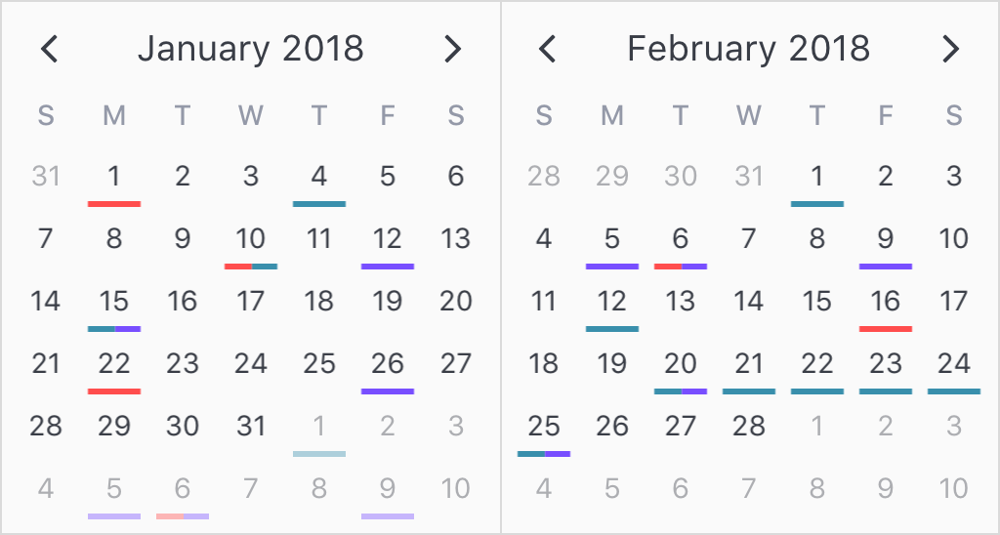

## Bars

Bars are very similar to dots in the way they are configured. Like dots, they can also be applied to both single date and date ranges. When more than one bar is dislayed per calendar day, they are equally spaced amongst each other. As a result, it might be a good idea to limit displaying up to 2 to 3 bars per day cell, as legibility can suffer.

<p align='center'>
  
</p>

```html
<v-calendar
  :attributes='attributes'
  is-double-paned>
</v-calendar>
```

```javascript
export default {
  data() {
    return {
      attributes: [
        {
          bar: {
            backgroundColor: '#ff4d4d',     // Red bar
          },
          dates: [
            new Date(2018, 0, 1),           // Jan 1st
            new Date(2018, 0, 10),          // Jan 10th
            new Date(2018, 0, 22),          // Jan 22nd
            new Date(2018, 1, 6),           // Feb 6th
            new Date(2018, 1, 16),          // Feb 16h
          ],
        },
        {
          bar: {
            backgroundColor: '#398fac',     // Turquoise bar
          },
          dates: [
            new Date(2018, 0, 4),           // Jan 4th
            new Date(2018, 0, 10),          // Jan 10th
            new Date(2018, 0, 15),          // Jan 15th
            new Date(2018, 1, 1),           // Feb 1st
            new Date(2018, 1, 12),          // Feb 12th
            {
              start: new Date(2018, 1, 20), // Feb 20th
              end: new Date(2018, 1, 25),   // - Feb 25th
            },
          ],
        },
        {
          bar: {
            backgroundColor: '#794dff',     // Purple bar
          },
          dates: [
            new Date(2018, 0, 12),          // Jan 12th
            new Date(2018, 0, 26),          // Jan 26th
            new Date(2018, 0, 15),          // Jan 15th
            new Date(2018, 1, 5),           // Feb 5th
            new Date(2018, 1, 6),           // Feb 6th
            new Date(2018, 1, 9),           // Feb 9th
            new Date(2018, 1, 20),          // Feb 20th
            new Date(2018, 1, 25),          // Feb 25th
          ],
        },
      ],
    };
  },
};
```

If you would like to change the bottom margin or width of the dots container, you can do so via the `bars` style within the [`theme-styles`](api.md#theme-styles) prop, like so:

```html
<v-calendar
  :attributes='attributes'
  :theme-styles='themeStyles'
  is-double-paned>
</v-calendar>
```

```javascript
export default {
  data() {
    return {
      attributes: [
        // ...attributes with bars
      ],
      themeStyles: {
        bars: {
          marginBottom: '10px',
          width: '80%'
        }
      }
    }
  }
}
```

[Click here to reference all available bar properties.](api.md#bar)