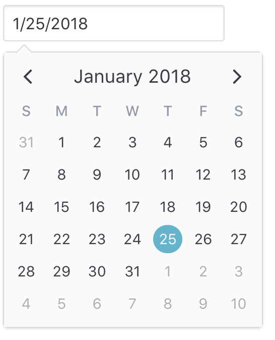

# Date Picker

## Overview

  

The built-in date picker `v-date-picker` is implemented as a wrapper for `v-calendar`. As a result, it comes with a lot of flexibility out of the box. For example, it can accept all props supported by `v-calendar` and emits all of the same events.