# Date Picker

[Click here to reference the API for `v-date-picker`.](api.md#date-picker)

`v-date-picker` is a powerful date picker delivered with `v-calendar`. It is quite simply just a wrapper around `v-calendar` so it comes with a lot of flexibility out of the box. For example, it can accept all props supported by `v-calendar` and emits all of the same events. By default, it displays the picker in a popover for an input element (which can be replaced with its default slot) but can display inline by setting the `is-inline` prop.

<div class='distributed'>
  
  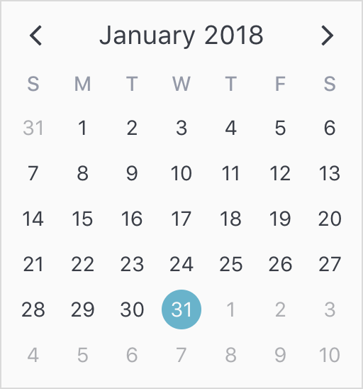
</div>

It actually just uses attributes under the hood to represent date selections (specifically a highlight and content style) but these attributes are [completely customizable](#customize-select--drag-attributes). For example, you could change the date selection to dots instead of a highlight if that makes more sense for your application. Also, it takes advantage of native `v-calendar` events to update the selected and dragged values when day cells are clicked or dragged over, respectively.

## Selection Modes

`v-date-picker` can be configured to operate in 3 different selection modes via the `mode` prop.
  * Single Date (`mode = "single"`)
  * Multiple Date (`mode = "multiple"`)
  * Date Range (`mode = "range"`)

### Single Date

The first and most common mode is single date selection. It uses a native Javascript `Date` object for its internal `value`, and the value can be cleared by setting the value to `null`. This is the default mode, so it can be omitted if desired:

```html
<v-date-picker
  v-model='myDate'>
</v-date-picker>
```

```javascript
export default {
  data() {
    return {
      myDate: new Date(2018, 0, 25) // Jan 25th, 2018
    }
  }
}
```

<div class='distributed'>
  
</div>

### Multiple Dates

The second mode is multiple date selection. It uses an array of `Date` objects for its internal `value` state. The selected value can be cleared by setting the value to `null` or an empty array `[]`. 

```html
<v-date-picker
  mode='multiple'
  v-model='myDates'>
</v-date-picker>
```

```javascript
export default {
  data() {
    return {
      myDates: [
        new Date(2018, 0, 1), // Jan 1st, 2018
        new Date(2018, 0, 15) // Jan 15th, 2018
        new Date(2018, 0, 29) // Jan 29th, 2018
      ]
    }
  }
}
```

<div class='distributed'>
  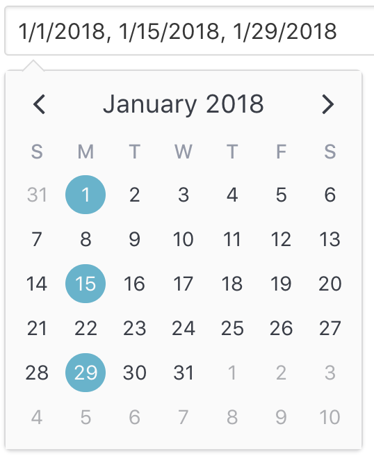
</div>

When used as a popover (`is-inline` is `false`), the user may enter dates in the input element as a list of comma separated date values. Each date is parsed using the parser specified by the `date-parser` prop function. If the user clears out the input text, the value is set to `null`. [Read this to learn how to configure the input element.](#customize-input-element)

### Date Range

The third mode is date range selection. It uses an object consisting of optional start and end dates. The selected value can be cleared by setting the value to `null`. Using an empty object `{ }` for the value is equivalent to a range with infinite start and end dates.

```html
<v-date-picker
  mode='range'
  v-model='myRange'
  show-caps>
</v-date-picker>
```

```javascript
export default {
  data() {
    return {
      myRange: {
        start: new Date(2018, 0, 16), // Jan 16th, 2018
        end: new Date(2018, 0, 19)    // Jan 19th, 2018
      }
    }
  }
}
```

<div class='distributed'>
  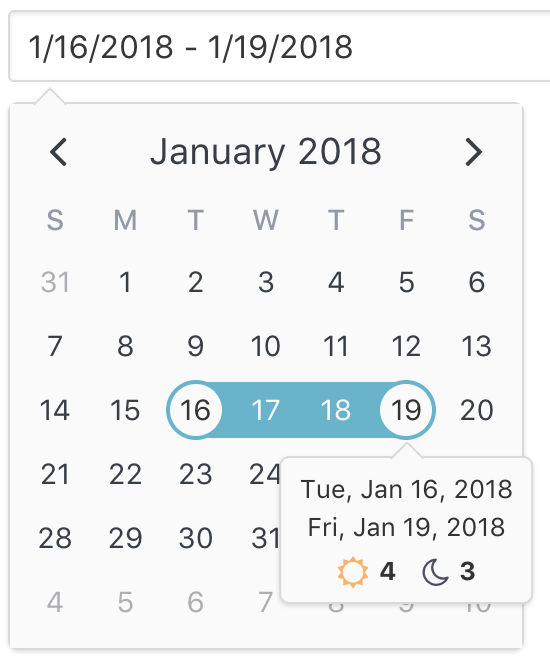
</div>

You can see how the default popover for the range selection displays the currently selected (or dragged) start date and end date with indicators showing the length of the day and night spans. As expected, [this popover can also be configured to your own slot or component](#customize-popover).

## How To

Below are guides to performing common tasks with `v-date-picker`.

### Format & Parse Dates

Please reference the [formatting & parsing section of the README](readme.md#formatting--parsing) for steps to customizing the input element's formatting and parsing behavior.

### Set Min/Max Dates

Set min and max dates by assigning their respective props.

```html
<v-date-picker
  v-model='myDate'
  :min-date='new Date(2018, 0, 1)'
  :max-date='new Date(2018, 0, 31)'>
</v-date-picker>
```

<div class='distributed'>
  
</div>

These props are implemented under the hood by modifying the `disabled-dates` prop. Note, though, that you can still use the `disabled-dates` prop while still using the `min-date` and `max-date` props. They are simply provided for convenience sake.

### Disable Dates & Patterns

Sometimes you need more control than simply disabling minimum and maximum dates. That is where `disabled-dates` and `available-dates` come in handy.

The best way to understand them is to understand that disabled dates in general for `v-date-picker` are implemented using, you guessed it, an attribute. There is a `disabled-attribute` (which you [can customize](#customize-attributes)) that simply uses `disabled-dates` for its `dates` expression and `available-dates` for its `exclude-dates` expression. So, to understand how they work, you simply need to understand [the rules for configuring dates with attributes](attributes.md#using-dates).

Let's consider the previous example of setting a min and max dates. Suppose we would also like to disable the weekends. Here is how that would look.

```html
<v-date-picker
  v-model='myDate'
  :min-date='new Date(2018, 0, 1)'
  :max-date='new Date(2018, 0, 31)'
  :disabled-dates='{ weekdays: [1, 7] }'>
</v-date-picker>
```

<div class='distributed'>
  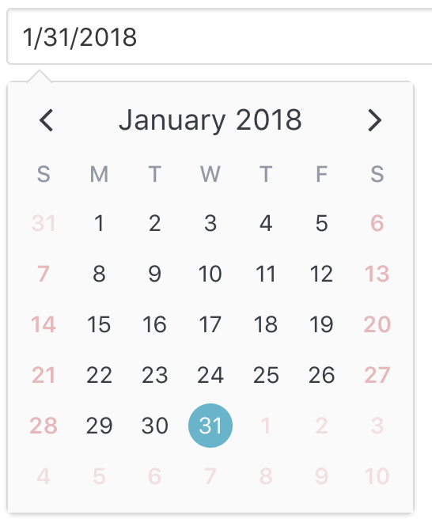
</div>

### Require Selected Date

There are 3 ways to clear a selected date (`value = null`).
  1. Assign `null` to `value` prop or to local state variable that is bound to using `v-model`
  2. User toggles selected dates by clicking them on the calendar (only valid when `mode` is `"single"` or `"multiple"`)
  3. User clears the input element text and commits the change by pressing the `enter` key or changing focus (`blur` event)

You can prevent methods 2 and 3 by setting the `is-required` prop to `true`.

> Note: This effectively prevents the *user* from clearing the value. The developer can still clear it via method 1.

### Customize Input Element

> Note: The following applies for date pickers in popover mode (`is-inline === false`)

There are 2 ways to customize the input element for `v-date-picker`
  1. Apply props for styling and behavior to the built in `input` element.
  2. Provide your own custom slot to use for the `input` element or omit it entirely.

#### Using `input-props`

By default, `v-date-picker` leaves the `input` element as a bare element with no attributes applied. However, it is very easy to apply your own classes, styling, readonly behavior, placeholder and more by using the `input-props` prop. This is an object you can use to configure the element as if you configuring it directly.

Here, we assign a Bulma class, a placeholder and make the input readonly so the user has to select a date via the calendar.

```html
<v-date-picker
  v-model='myDate'
  :input-props='{ class: "input", placeholder: "Please enter your birthday", readonly: true }'>
</v-date-picker>
```

<div class='distributed'>
  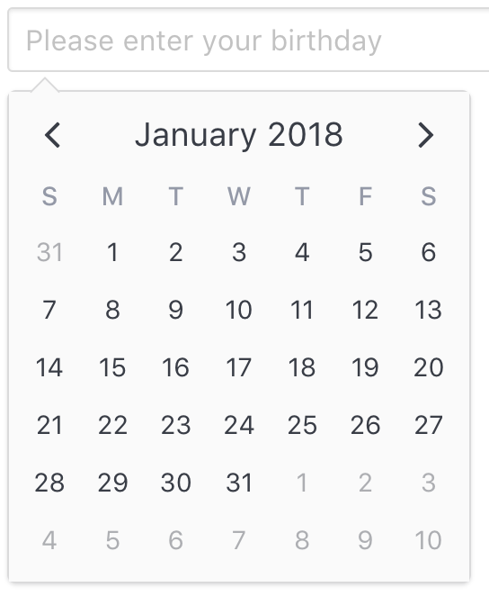
</div>

#### Using Custom Slot

If you would like a more customized experience, you can use a custom slot to use as a trigger for the date picker popover element. For example, perhaps you would like to use a custom form component or include a button to clear the input value.

Here are the steps to utilize this approach.

  1. Create a custom slot within `v-date-picker`. You don't have to name it, as we'll be using the default slot. Be sure to extract out the following props by using `slot-scope`, when needed:

| Prop | Description |
| ---- | ----------- |
| `inputValue` | The formatted value to bind to your own input element. |
| `updateValue` | Function that appropriately updates the value with your accepted value at the time of your choosing. |
  2. Bind the `inputValue` to your input value.
  3. Call `updateValue(*newValue*)` to parse (if a string is passed) and correctly validate the value, depending on what constraints are currently applied (`disabled-dates`, `available-dates`, `min-date`, `max-date`). You can also pass the raw value (`Date`, `Array[Date]` or `Object`, depending on current `mode`) if needed.

  Here is an example using custom components from [Buefy](https://buefy.github.io) and a **Clear** button to clear out the date.

```html
<template>
  <v-date-picker
    v-model='selectedValue'
    is-expanded>
    <b-field
      :type='inputState.type'
      slot-scope='{ inputValue, updateValue }'>
      <b-input
        type='text'
        icon='calendar'
        :value='inputValue'
        :placeholder='inputState.message'
        @change.native='updateValue($event.target.value)'
        expanded>
      </b-input>
      <p
        class='control'
        v-if='selectedValue'>
        <a
          :class='["button", inputState.type]'
          @click='selectedValue = null'>
          Clear
        </a>
      </p>
    </b-field>
  </v-date-picker>
</template>
```

```javascript
export default {
  data() {
    return {
      selectedValue: null,
    };
  },
  computed: {
    inputState() {
      if (!this.selectedValue) {
        return {
          type: 'is-danger',
          message: 'Date required.',
        };
      }
      return {
        type: 'is-primary',
        message: '',
      };
    },
  },
};
```
<div class='distributed'>
  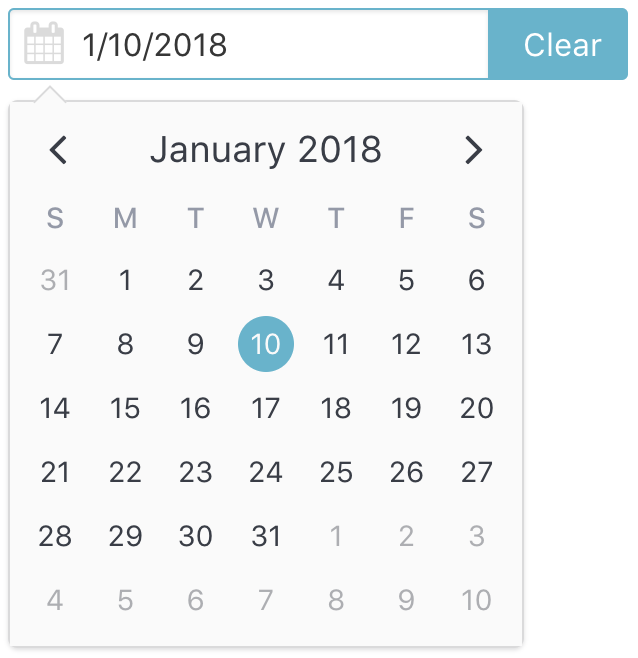
</div>

### Customize Attributes

`v-date-picker` uses the following properties to properly display and validate date selections:

| Attribute | Description |
| --------- | ----------- |
| `tint-color` | Color of the selected attribute and drag attribute (with `opacity: 0.5` for drag). Overridden by `select-attribute` and `drag-attribute` if specified. |
| `select-attribute` | Attribute used to represent the selected value. |
| `drag-attribute` | Attribute used to represent the dragged value. Valid only when `mode === "range"`. |
| `disabled-attribute` | Attribute used to represent disabled days. |

The `tint-color` prop is a convenience prop for just changing the select and drag colors without having to worry about configuring the `select-attribute` and `drag-attribute` props themselves. The `select-attribute` and `drag-attribute` props, however, override `tint-color` as they are used for more detailed configuration of the attributes.

To customize these attributes, we just need to provide our own custom attributes objects. Any attributes we provide will replace the default ones.

> Note: Attribute keys are automatically assigned for us (`"drag-select"` for the `select-attribute` and `drag-attribute`, "disabled" for `disabled-attribute`). The `disabled-attribute` is also assigned an `order` of `100`, so it can take precedence over the others.

For example, say we want to use a `dot` instead of a `highlight` to denote the selected date. All we would need to do is pass a new `select-attribute`:


```html
<v-date-picker
  v-model='myDate'
  :select-attribute='myAttribute'>
</v-date-picker>
```

```javascript
export default {
  data() {
    return {
      myDate: null,
      myAttribute: {
        dot: {
          backgroundColor: 'red'
        }
      }
    }
  }
}
```

<div class='distributed'>
  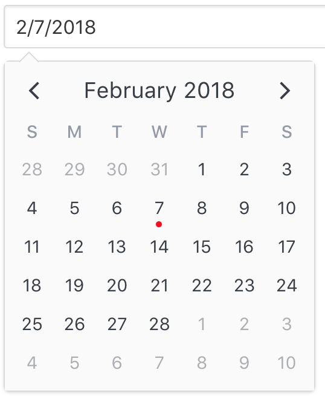
</div>

Or if we want disabled dates to display a line-through the days...

```html
<v-date-picker
  v-model='myDate'
  :disabled-attribute='disabledAttribute'>
</v-date-picker>
```

```javascript
export default {
  data() {
    return {
      myDate: null,
      disabledAttribute: {
        contentStyle: {
          color: 'red',
          textDecoration: 'line-through',
          opacity: 0.5
        },
        // We need to override the default `dayContentHover` theme style set by `v-date-picker`
        contentHoverStyle: {
          cursor: 'default',
          backgroundColor: 'transparent',
        },
      }
    }
  }
}
```

<div class='distributed'>
  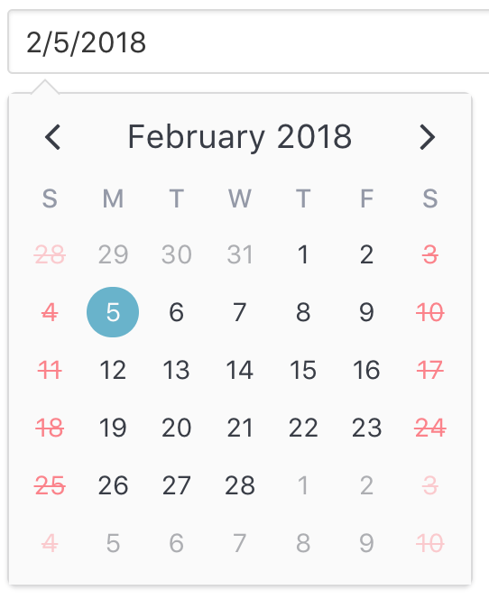
</div>

### Customize Selection Popover

When the user makes a date selection, a default popover is shown that
  * Displays the selected day when `mode === "single" || mode === "multiple"`
  
<div class='distributed'>
  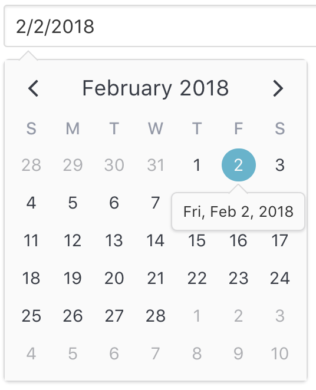
</div>

  * Displays the start date, end date, day and night spans when `mode === "range"`

<div class='distributed'>
  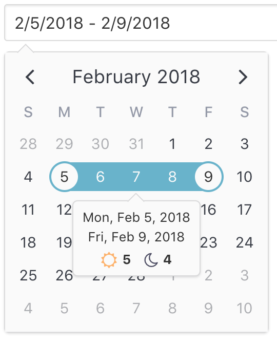
</div>

If you would like to provide your own popover, you can do so by configuring the `popover` object for the `select-attribute` and/or the `drag-attribute` to display your own custom component (often, a single file component).

> Note: Configuring the popover using [`slots`](popovers.md#slots) is not currently supported because `v-date-picker` does not pass down slots into `v-calendar`.

In fact, you can see how `v-date-picker` configures its own popover component by [referencing the steps for using a custom component as a popover content row](popovers.md#components).

### Show Clear Margin

When `v-date-picker` appears as a popover, anything below it is covered because of its absolute positioning. If you would like to automatically apply a margin equal to the height of the popover calendar whenever it appears, set `popover-show-clear-margin` to `true`.

#### ***Without Clear Margin***

```html
<div class='field'>
  <label class='label'>
    Name
  </label>
  <div class='control'>
    <input class='input'>
  </div>
</div>
<div class='field'>
  <label class='label'>
    Birthday
  </label>
  <div class='control'>
    <v-date-picker
      v-model='date'>
    </v-date-picker>          
  </div>
</div>
<div class='field'>
  <label class='label'>
    Email
  </label>
  <div class='control'>
    <input class='input' type='email'>
  </div>
</div>
```

<div>
  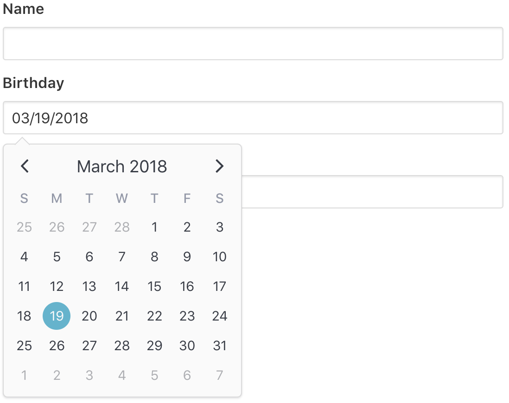
</div>

#### ***With Clear Margin***

```html
<div class='field'>
  <label class='label'>
    Name
  </label>
  <div class='control'>
    <input class='input'>
  </div>
</div>
<div class='field'>
  <label class='label'>
    Birthday
  </label>
  <div class='control'>
    <v-date-picker
      v-model='date'
      popover-show-clear-margin>
    </v-date-picker>          
  </div>
</div>
<div class='field'>
  <label class='label'>
    Email
  </label>
  <div class='control'>
    <input class='input' type='email'>
  </div>
</div>
```

<div>
  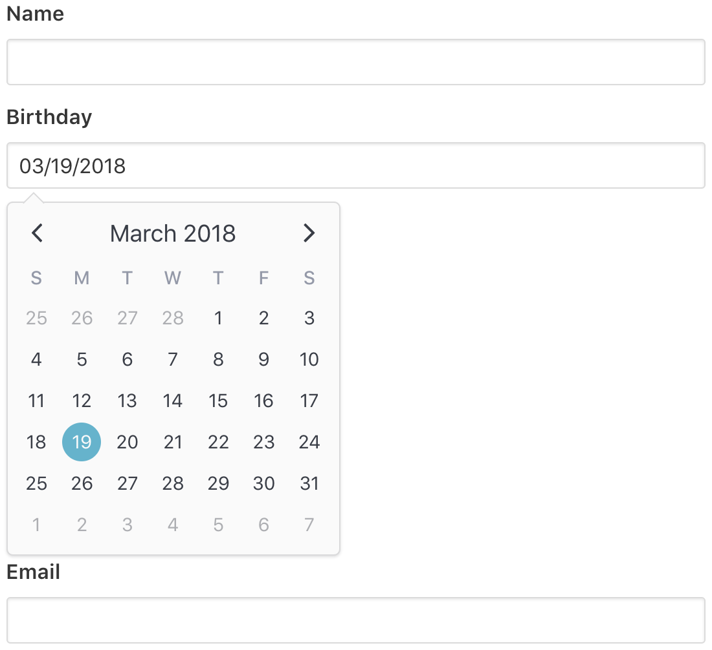

</div>

### HTML Form Integration

If needing to submit the date value to 