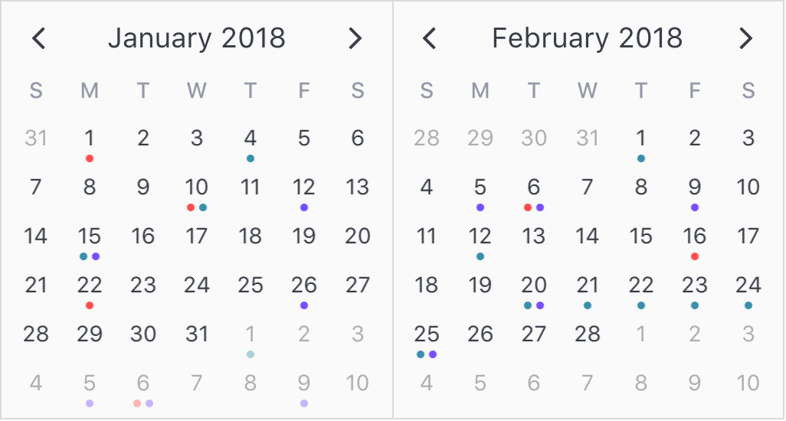

## Dots

Dots are a good way to dislay a dense amount of calendar data. They appear neatly at the bottom of day cells, spread evenly apart from each other. While dots can obviously be displayed for single dates, they can also be displayed for date ranges as well. They are simply repeated for every day that lies between the range start and end dates. If a date pattern is used, they only display on days that match the specified date pattern.

<p align='center'>
  
</p>

```html
<v-calendar
  :attributes='attributes'
  is-double-paned>
</v-calendar>
```

```javascript
export default {
  data() {
    return {
      attributes: [
        {
          dot: {
            backgroundColor: '#ff4d4d', // Red dot
          },
          dates: [
            new Date(2018, 0, 1),           // Jan 1st
            new Date(2018, 0, 10),          // Jan 10th
            new Date(2018, 0, 22),          // Jan 22nd
            new Date(2018, 1, 6),           // Feb 6th
            new Date(2018, 1, 16),          // Feb 16th
          ],
        },
        {
          dot: {
            backgroundColor: '#398fac', // Turquoise dot
          },
          dates: [
            new Date(2018, 0, 4),           // Jan 4th
            new Date(2018, 0, 10),          // Jan 10th
            new Date(2018, 0, 15),          // Jan 15th
            new Date(2018, 1, 1),           // Feb 1st
            new Date(2018, 1, 12),          // Feb 12th
            {
              start: new Date(2018, 1, 20), // Feb 20th
              end: new Date(2018, 1, 25),   // - Feb 25th
            },
          ],
        },
        {
          dot: {
            backgroundColor: '#794dff',     // Purple dot
          },
          dates: [
            new Date(2018, 0, 12),          // Jan 12th
            new Date(2018, 0, 26),          // Jan 26th
            new Date(2018, 0, 15),          // Jan 15th
            new Date(2018, 1, 5),           // Feb 5th
            new Date(2018, 1, 6),           // Feb 6th
            new Date(2018, 1, 9),           // Feb 9th
            new Date(2018, 1, 20),          // Feb 20th
            new Date(2018, 1, 25),          // Feb 25th
          ],
        },
      ],
    };
  },
};
```

If you would like to change the bottom margin of the dots container, you can do so via the `dots` style within the [`theme-styles`](api.md#theme-styles) prop, like so:

```html
<v-calendar
  :attributes='attributes'
  :theme-styles='themeStyles'
  is-double-paned>
</v-calendar>
```

```javascript
export default {
  data() {
    return {
      attributes: [
        // ...attributes with dots
      ],
      themeStyles: {
        dots: {
          marginBottom: '10px'
        }
      }
    }
  }
}
```

[Click here to reference all available dot properties.](api.md#dot)
