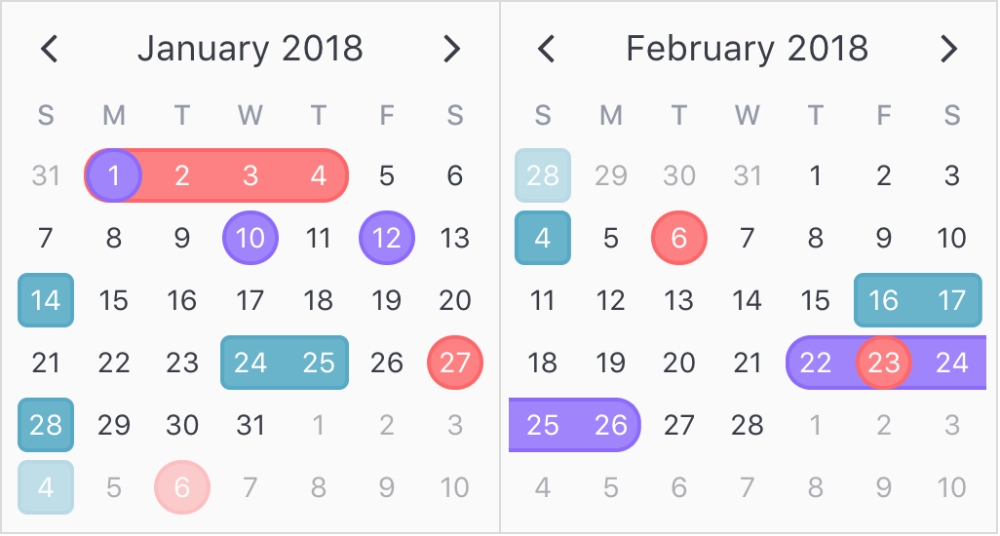

## Highlights

Highlights are simply 'highlighted' regions with custom defined height, background and border properties. For date regions (start and end date), they appear as a single continous span with specified border radius applied only to the end caps.

<p align='center'>
  
</p>

```html
<v-calendar
  :attributes='attributes'
  is-double-paned>
</v-calendar>
```

```javascript
export default {
  data() {
    return {
      attributes: [
        {
          highlight: {
            backgroundColor: '#ff8080',     // Red background
            borderColor: '#ff6666',
            borderWidth: '2px',
            borderStyle: 'solid',
          },
          contentStyle: {
            color: 'white',                 // White text
          },
          dates: [
            {
              start: new Date(2018, 0, 1),  // Jan 1st
              end: new Date(2018, 0, 4),    // - Jan 4th
            },
            {
              start: new Date(2018, 0, 1),  // Starting Jan 1st
              ordinalWeekdays: { [-1]: 7 }, // On last Sat of every month
              // end: null,                 // Infinite end date is implied
            },
            new Date(2018, 1, 6),           // Feb 6th
            new Date(2018, 1, 23),          // Feb 23rd
          ],
        },
        {
          highlight: {
            backgroundColor: '#9f80ff',     // Purple background
            borderColor: '#8c66ff',
            borderWidth: '2px',
          },
          contentStyle: {
            color: 'white',                 // White text
          },
          dates: [
            new Date(2018, 0, 1),           // Jan 1st
            new Date(2018, 0, 10),          // Jan 10th
            new Date(2018, 0, 12),          // Jan 12th
            {
              start: new Date(2018, 1, 22), // Feb 22nd
              end: new Date(2018, 1, 26),   // - Feb 26th
            },
          ],
        },
        {
          highlight: {
            backgroundColor: '#66b3cc',     // Turquoise background
            borderColor: '#53a9c6',
            borderWidth: '2px',
            borderRadius: '5px',
          },
          contentStyle: {
            color: 'white',                 // White text
          },
          dates: [
            new Date(2018, 0, 14),          // Jan 14th
            {
              start: new Date(2018, 0, 24), // Jan 24th
              end: new Date(2018, 0, 25),   // - Jan 25th
            },
            new Date(2018, 0, 28),          // Jan 28th
            new Date(2018, 1, 4),           // Feb 4th
            {
              start: new Date(2018, 1, 16), // Feb 16th
              end: new Date(2018, 1, 17),   // - Feb 17th
            },
          ],
        },
      ],
    };
  },
};
```

One thing to observe is that all attributes use the default `order`, but layering is appropriately applied in order to display the most information possible. So, single date highlights appear above date range highlights.

[Click here to reference all available highlight properties.](api.md#highlight)