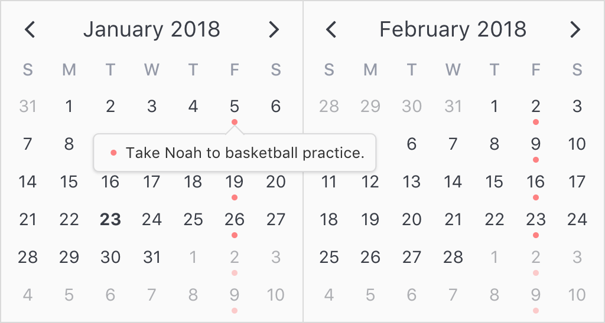
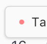
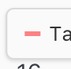
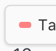
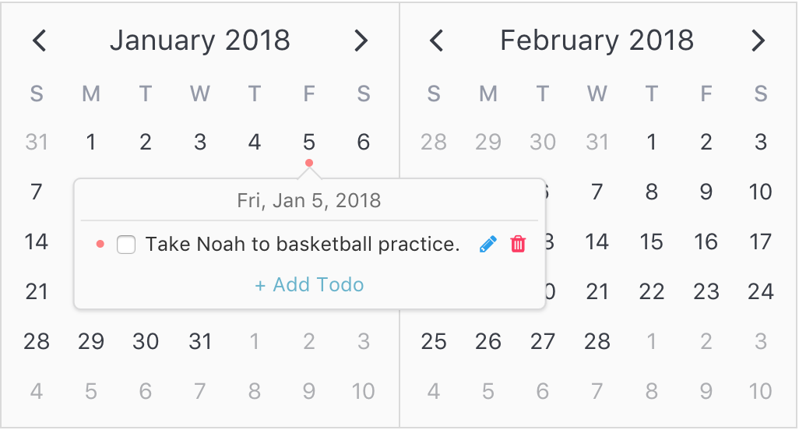
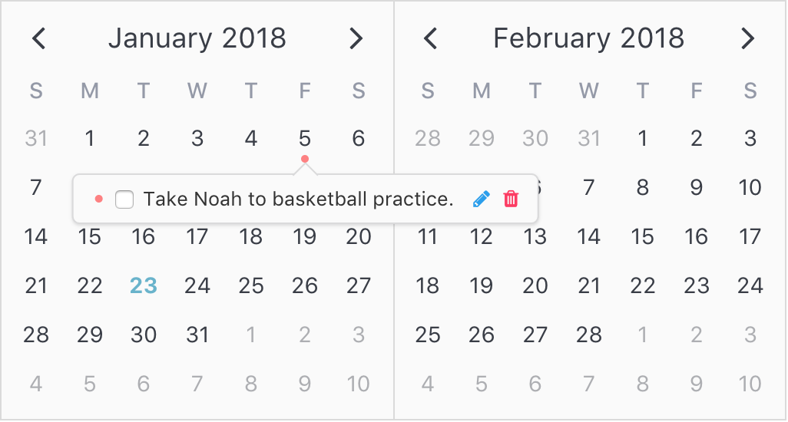

## Popovers

[Click here to reference all available popover properties.](api.md#popover)

Popovers provide unique opportunities for users to interact with your web applications. Displaying rich content feedback or supporting inline content editing are two such use cases. Popovers come with lots of configurability built-in, including how and when they are displayed as well as how users should be allowed to interact with them.

Popovers are configured on a per-attribute basis. That is, each attribute can configure its own popover content row. When two or more attributes would like to display popovers on the same day, the two rows are simply concatenated and displayed together in the same popover content window (the order of which is determined by the attribute's `order` property).

Popovers come in two basic flavors:

### Labels

Labels are the basic tooltip-style popover. They are configured as simple strings. By default, these popovers display when the user hovers over the day content and are not interactive to the user.

Consider the following example:

<p align='center'>
  
</p>

```html
<template>
  <v-calendar
    :attributes='attributes'
    is-double-paned>
  </v-calendar>
</template>
```

```javascript
const todos = [
  {
    description: 'Take Noah to basketball practice.',
    isComplete: false,
    dates: { weekdays: 6 }, // Every Friday
    color: '#ff8080',       // Red
  },
];
export default {
  data() {
    return {
      incId: todos.length,
      meetings,
      todos,
    };
  },
  computed: {
    attributes() {
      return [
        // Today attribute
        {
          contentStyle: {
            fontWeight: '700',
            fontSize: '.9rem',
          },
          dates: new Date(),
        },
        // Attributes for todos
        ...this.todos.map(todo => ({
          dates: todo.dates,
          dot: {
            backgroundColor: todo.color,
            opacity: todo.isComplete ? 0.3 : 1,
          },
          popover: {
            label: todo.description,
          },
        })),
      ];
    },
  },
};
```

As you can see, all we needed to do was assign a simple string to the `popover.label` property. This signals to `v-calendar` that it needs to display that string in a popover whenever the user hovers over the day content.

> Note: On mobile devices, users will still need to tap on the content since there is no concept of hovering on mobile.

If we want to force the user to click on the day content in order to display the popover, we can set the popover's `visibility` property to `"focus"`.

```javascript
    ...
    popover: {
      label: todo.description,
      visibility: 'focus'
    }
    ...
```

Also, you'll notice there is a small indicator next to the popover content row for the attribute. This is a simple indicator provided in order to help the user match up the popover content rows to the indicators in the calendar day cell. The indicator will try to coordinate the colors and shapes as closely as possible.

In the previous example, because a red dot was used, the indicator displays the same.

<p align='center'>
  
</p>

Here is how a bar or highlight would appear, respectively.

<p align='center'>
  
  
</p>

If you would like to hide the indicator, just set the `hideIndicator` property to `true`;

```javascript
    ...
    popover: {
      label: todo.description,
      visibility: 'focus',
      hideIndicator: true,
    }
    ...
```

### Slots

Slots provide a more advanced method to displaying popover content for attributes. You simply create nested slots within `v-calendar` with unique names that can be referenced by popover objects created in your Javascript code.

In the previous example, we used simple popover labels to display todos in the calendar. This is a nice feature, but it would be *really* nice to allow the user to mark todos as completed or edit the todo description directly in the calendar itself. We can do this using slots.

<p align='center'>
  
</p>

#### Step 1: Create the slot in the template

First, we need to define a slot to be used by one or more attribute popovers. To do this, we can just create a slot with a name that doesn't clash with one of `v-calendar`'s [existing slot names](api.md#calendar-slots).

For our example, we'll create a slot with the name of `"todo-row"`. For our benefit, this slot is supplied with the following props which we can reference via the `slot-scope` element attribute:

| Property | Description |
| -------- | ----------- |
| `attribute` | The attribute object associated with the popover content row. |
| `customData` | The custom data associated with the attribute above. Shortcut for `attribute.customData`. |
| `day` | The [day object](api.md#day-object) associated with the popover. |

> Note: If you are not familiar with the convention of using scoped slots in Vue.js, you can reference the [Vue docs](https://vuejs.org/v2/guide/components.html#Scoped-Slots) or [this post by alligator.io](https://alligator.io/vuejs/scoped-component-slots/).


```html
<template>
  <v-calendar
    :attributes='attributes'
    is-double-paned>
    <!--===============TODO ROW SLOT==============-->
    <div
      slot='todo-row'
      slot-scope='{ customData }'
      class='todo-row'>
      <!--Todo content-->
      <div class='todo-content'>
        <!--Show textbox when editing todo-->
        <input
          class='todo-input'
          v-if='customData.id === editId'
          v-model='customData.description'
          @keyup.enter='editId = 0'
          v-focus-select />
        <!--Show status/description when not editing-->
        <span
          v-else>
          <!--Completed checkbox-->
          <input
            type='checkbox'
            v-model='customData.isComplete' />
          <!--Description-->
          <span
            :class='[
              "todo-description",
              { "complete": customData.isComplete }]'
            @click='toggleTodoComplete(customData)'>
            {{ customData.description }}
          </span>
        </span>
      </div>
      <!--Edit/Done buttons-->
      <a @click.prevent='toggleTodoEdit(customData)'>
        <!--Edit button-->
        <b-icon
          v-if='editId !== customData.id'
          icon='pencil'
          type='is-info'
          size='is-small'>
        </b-icon>
        <!--Done button-->
        <b-icon v-else
          icon='check'
          type='is-success'
          size='is-small'>
        </b-icon>
      </a>
      <!--Delete button-->
      <a
        @click.prevent='deleteTodo(customData)'
        v-if='!editId || editId !== customData.id'
        class='delete-todo'>
        <b-icon
          icon='trash'
          type='is-danger'
          size='is-small'>
        </b-icon>
      </a>
    </div>
  </v-calendar>
</template>
```

#### Step 2: Reference the slot from the attribute's popover object

Once we have created the uniquely named slot, all we need to do is reference that name from the `popover.slot` property.

```javascript
const color = '#ff8080';
const todos = [
  {
    id: 1,
    description: 'Take Noah to basketball practice.',
    isComplete: false,
    dates: new Date(2018, 0, 5),
  }
];

export default {
  data() {
    return {
      incId: todos.length,
      editId: 0,
      todos,
    };
  },
  computed: {
    attributes() {
      return [
        // Today attribute
        {
          contentStyle: {
            fontWeight: '700',
            color: '#66b3cc',
          },
          dates: new Date(),
        },
        // Todo attributes
        ...this.todos.map(todo => ({
          key: todo.id,
          dates: todo.dates,
          customData: todo,
          order: todo.id,
          dot: {
            backgroundColor: color,
            opacity: todo.isComplete ? 0.3 : 1,
          },
          popover: {
            slot: 'todo-row', // Matches slot from above
            visibility: 'focus',
          }
        }))
      ];
    }
  },
  methods: {
    toggleTodoComplete(todo) {
      todo.isComplete = !todo.isComplete;
    },
    toggleTodoEdit(todo) {
      this.editId = (this.editId === todo.id) ? 0 : todo.id;
    },
    deleteTodo(todo) {
      this.todos = this.todos.filter(t => t !== todo);
    }
  },
  directives: {
    focusSelect: {
      inserted(el) {
        el.focus();
        el.select();
      }
    }
  }
};
```

<p align='center'>
  
</p>

Let's note a few things from the example above:

  1. We reference the attribute's `customData` via the `slot-scope` in order to properly display and edit the todo.
  2. From within the slot, we can now call methods to delete and edit the todo using the `customData`.
  3. From within the methods, we can mutate the list of todos (when deleting) or the todo itself (when marking complete or editing description).
  4. These edits modify the state of the todos array. The attributes are then re-computed from this array and the UI is updated accordingly.

Before wrapping up this example, we still need to add a custom day header and implement a way to add new todos. To do this, we'll utilize the `day-popover-header` slot and add a new dedicated `add-todo` slot below.

```html
  ...
  <!--=========DAY POPOVER HEADER SLOT=========-->
  <div
    slot='day-popover-header'
    slot-scope='{ day }'
    class='popover-header'>
    {{ getPopoverHeaderLabel(day) }}
  </div>
  <!--===============TODO ROW SLOT==============-->
  ...
  ...
  ...
  <!--================ADD TODO ROW SLOT===============-->
  <div
    slot='add-todo'
    slot-scope='{ day }'
    class='add-todo'>
    <a @click='addTodo(day)'>
      + Add Todo
    </a>
  </div>
  ...
```

Then we can add the new 'Add Todo' attribute to the attributes list.

```javascript
...
computed: {
  attributes: [
    // Today attribute
    ...
    // Todo attributes
    ...
    // 'Add Todo' attribute
    {
      contentHoverStyle: {
        backgroundColor: 'rgba(0, 0, 0, 0.1)',
        cursor: 'pointer',
      },
      dates: {}, // All dates
      popover: {
        slot: 'add-todo',
        visibility: 'focus',
        hideIndicator: true,
      }
    }
  ]
},
...
```

Finally, we'll just add the methods to
  1. Get the popover header label
  2. Add a todo that gets called when the 'Add Todo' button is clicked.

```javascript
  ...
  methods: {
    ...
    getPopoverHeaderLabel(day) {
      const options = { weekday: 'short', year: 'numeric', month: 'short', day: 'numeric' };
      return day.date.toLocaleDateString(window.navigator.userLanguage || window.navigator.language, options);
    },
    addTodo(day) {
      this.editId = ++this.incId;
      this.todos.push({
        id: this.editId,
        description: 'New todo',
        isComplete: false,
        dates: day.date,
      });
    },
  }
```

<p align='center'>
  
</p>

Awesome! Below is the CSS for completeness. :tada: :tada: :tada:

```css
.popover-header {
  text-align: center;
  padding-bottom: 3px;
  border-bottom: 1px solid #dadada;
  margin: 0 0 3px 0;
  opacity: 0.7;
}

.todo-row {
  display: flex;
  flex-wrap: none;
  width: 100%;
}

.todo-content {
  flex-grow: 1;
  flex-basis: 0;
  margin-right: 10px;
  min-width: 80px;
}

.todo-input {
  width: 100%;
  min-width: 200px;
}

.todo-description {
  cursor: pointer;
  transition: all 0.1s ease-in-out;
  margin-left: 3px;
}

.todo-description:hover {
  opacity: 0.5;
}

.todo-description.complete {
  text-decoration: line-through;
}

.add-todo {
  font-size: 0.8rem;
  text-align: center;
  width: 100%;
}

.delete-todo {
  margin-left: 3px;
}
```

### Components

The third option for configuring popovers is through the use of custom components. This is much like the `slot` option, except instead of using a slot with our custom content, we use a dedicated component (often a Single File Component). The key difference is in the way we access the `attribute`, `customData` and `day` objects.

To access these objects, all we need to do is declare them as props on our custom component, and they will get passed in automatically by `v-date-picker` at the appropriate time. Perhaps the best way to understand this is to see how `v-date-picker` implements its native popover component for date selections.

<div class='distributed'>
  
</div>

> Note: This example will walk through how `v-date-picker` implements the native popover component. Replace any reference to `DatePickerDayPopover` with your own component.

#### Step 1: Create the component

Create a new single file component (.vue file). Declare the following props if needed:

| Prop | Type | Description |
| -------- | ----------- |
| `attribute` | Object | The attribute object associated with the popover content row. |
| `customData` | Object | The custom data associated with the attribute above. Shortcut for `attribute.customData`. |
| `day` | Object | The [day object](api.md#day-object) associated with the popover. |

Here are the template and script sections for the popover used with `v-date-picker`

```html
<template>
  <div>
    <div class='date-label'>
      <div v-if='dateLabel'>
        {{ this.dateLabel }}
      </div>
      <div v-if='startDateLabel'>
        {{ this.startDateLabel }}
      </div>
      <div v-if='endDateLabel'>
        {{ this.endDateLabel }}
      </div>
    </div>
    <div
      v-if='isRange'
      class='days-nights'>
      <span>
        <span
          class='vc-sun-o'>
        </span>
        {{ days }}
      </span>
      <span>
        <span
          class='vc-moon-o'>
        </span>
        {{ nights }}
      </span>
    </div>
  </div>
</template>
```

```javascript
export default {
  props: {
    attribute: Object, // This prop will get passed in by `v-date-picker`
  },
  computed: {
    date() {
      return this.attribute.targetDate;
    },
    isDate() {
      return this.date.isDate;
    },
    isRange() {
      return this.date.isRange;
    },
    days() {
      return this.date.daySpan + 1;
    },
    nights() {
      return this.date.daySpan;
    },
    dateLabel() {
      if (!this.date || !this.date.date) return '';
      return this.getDateString(this.date.date);
    },
    startDateLabel() {
      if (!this.date || !this.date.start) return '';
      return this.getDateString(this.date.start);
    },
    endDateLabel() {
      if (!this.date || !this.date.end) return '';
      return this.getDateString(this.date.end);
    },
  },
  methods: {
    getDateString(date) {
      const options = { weekday: 'short', year: 'numeric', month: 'short', day: 'numeric' };
      return date.toLocaleDateString(window.navigator.userLanguage || window.navigator.language, options);
    },
  },
};
```

From the attribute, we can extract information about the date it is associated with through its `targetDate` property. The `targetDate` is a [`DateInfo`](data.md#dateinfo--attributes-lifecycle) object wrapper that contains general information about the the date associated with the attribute. This includes information such as the start date, end date, day and night length spans.

#### Step 2: Import the component

Simply import the component into the file that is serving as the parent or host for the `v-calendar` or `v-date-picker` child components.

```javascript
import DatePickerDayPopover from './DatePickerDayPopover'; // .vue file
```

#### Step 3: Assign the component

Finally, when configuring the attribute (`select-attribute` and `drag-attribute` in this case), we assign the component to the popover's `component` property. Most often, if you are using your own component to display the popover content, it would be best to hide the default attribute indicator by setting `hideIndicator` to `true`.

```javascript
// ...configuring attribute
attribute: {
  // Configure the popover
  popover: {
    component: DatePickerDayPopover,
    hideIndicator: true // Don't want to show the indicator
  },
  // ...other attribute properties
}
```
